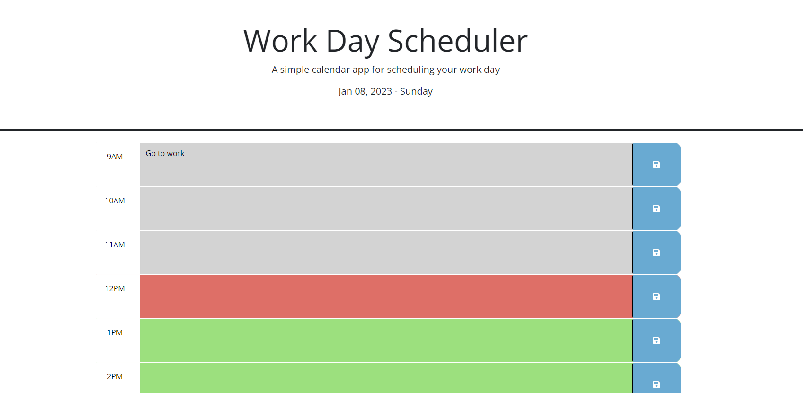
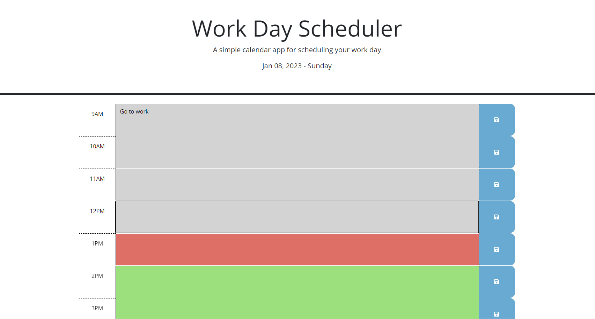

# day-planner
a daily planner to shows current and past task.

## Description

This is day planner that shows the date of the current day at the top. There will be a list of task for each hour of the day. You are able to enter a new task and save that task into the planner so you won't forget it even when you refresh the page. The task also changes color depending on the hour of the day. If it is present then the task will be highlighted red. If its a past task then it will be greyed out and if its a task for the next few hours then those task will be highlighted green. 

What I learned from this project is the usages of jquery and dayjs. I used jquery for DOM manipulation. I was able to grab parent and children nodes with jquery and then use it to manipulate the content in the HTML as well as grabing Id values from the node. I also used jquery as an event listener to listen to the buttons on the page. I learned how to use dayJS to compare time and to display time on the page. 

## Installation

N/A

## Usage

- open to the page
- look at the date at the top of the page
- look at the task for the day reflecting each hour
- if you want to add a task. click on the box and enter a new task. click the button on the right to save task
- continue until the rest of the day is filled out
- periodically check on the website throughout the day to see current and past task corsponding to the color of the task

[https://jjackielee.github.io/day-planner](https://jjackielee.github.io/day-planner)

## Credits

N/A

## License

N/A

---

## Features

When you enter a task and press save. The task will be saved onto the localstorage so it will not go away even if you refresh or exit the page. The color of each task will change depending on the time of the day to represent past, current and future task. 
